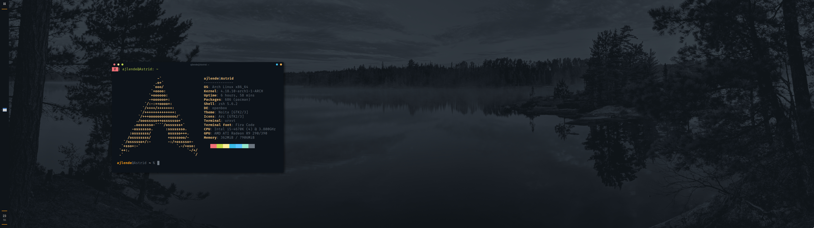
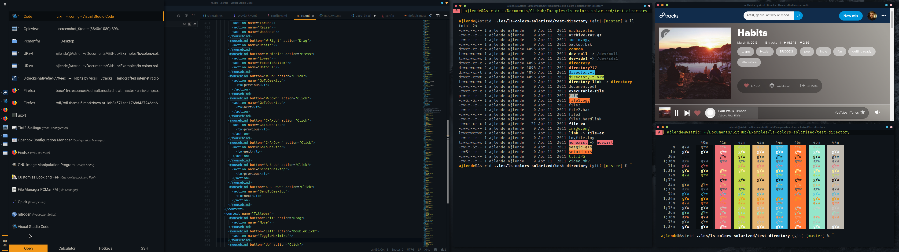

# Alex Lende's Configuration Files

## Installation

1. Clone and manually copy or symlink files to the home directory or wherever they belong.
2. Find and replace for `ajlende`. Make sure that paths exist.
3. Good luck!

## Packages

I've included a list of packages that appear in the configuration files in this repo. Some of them have configurations and others are required by configurations for other packages (ex. openbox keybindings).

- clipit
- compton
- firefox
- gitkracken
- grml-zsh-config
- gtk2
- gtk3
- keychain
- kitty
- lightdm
- lightdm-webkit-theme-litarvan
- lightdm-webkit2-greeter
- lxpolkit
- maim
- neofetch
- nitrogen
- nodejs
- noto-fonts-emoji
- openbox
- openbox-patched
- pcmanfm
- pikaur
- refind
- rofi
- rofi-calc
- rofimoji-git
- rvxt-unicode
- spaceship-prompt-git
- tint2
- tmux
- ttf-dejavu
- ttf-roboto
- ttf-windows
- unclutter
- unclutter-xfixes-git
- visual-studio-code-bin
- vlc
- x11vnc
- xclip
- yarn
- zsh

## Visual Studio Code Extensions

VS Code doesn't seem to allow exporting an extension list, so these are the extensions referenced in the config.

- Ayu (Ayu Dark Theme)
- Code Spell Checker
- GitLens
- Jest
- Vim (Config based on VSpaceCode)
- Color Highlight
- Prettier
- ESLint

## Other Required Things

- I use the Dank Mono font for my monospace font. It has to be purchased and installed manually.
