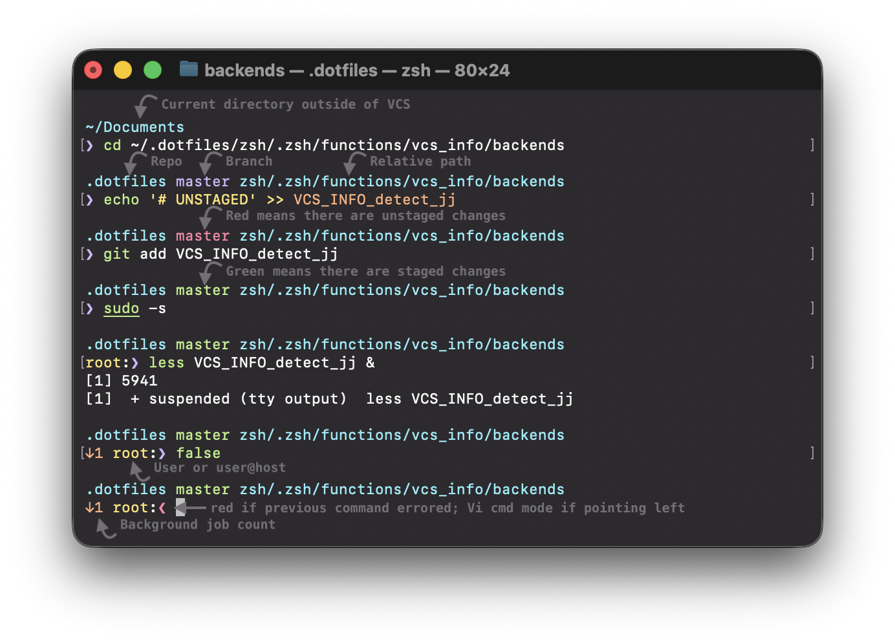
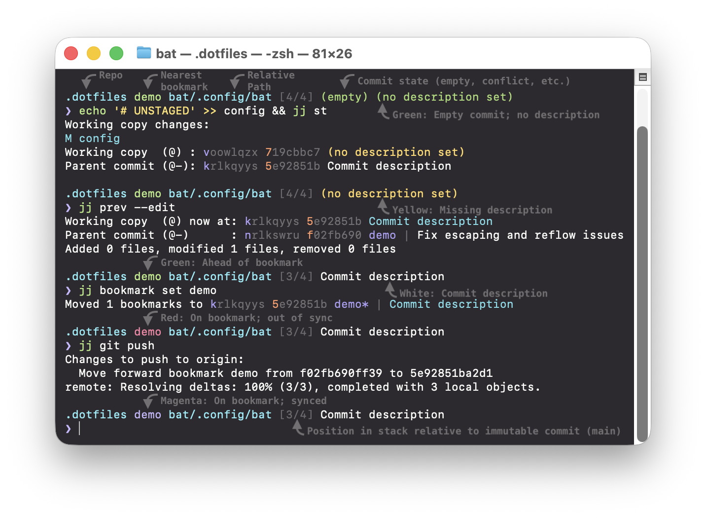
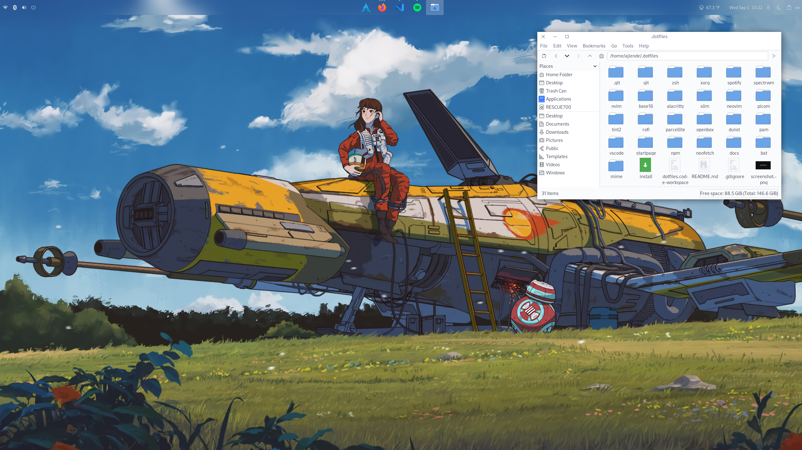
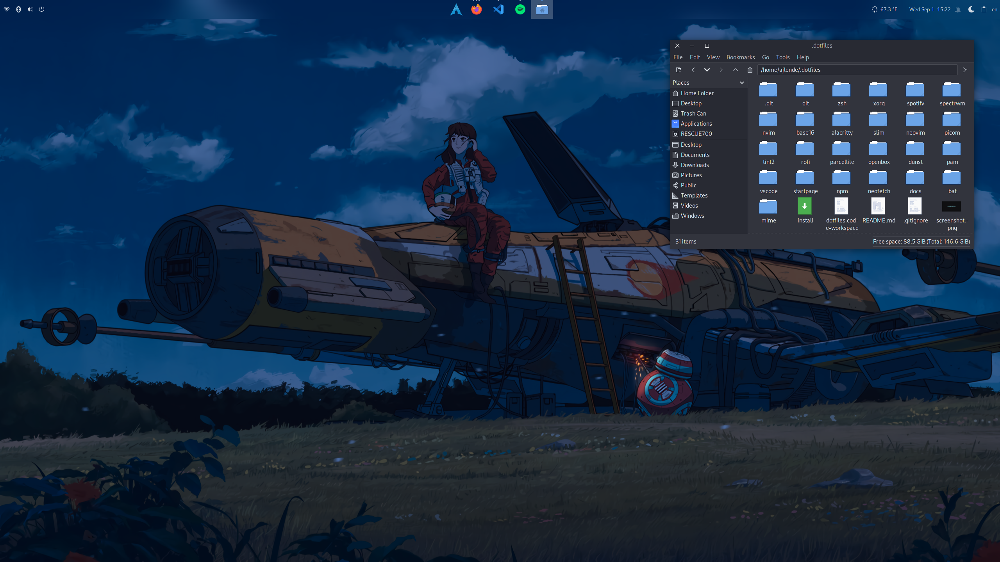

# Alex Lende's Dotfiles

## Aprompt zsh theme

Features:

- Minimal and fast ZSH prompt
- User switching
- SSH sessions
- Background jobs indicator
- Vi mode prompt symbol switching
- Git and Jujutsu (jj) version control system

<!-- prettier-ignore -->
| git | jj |
| --- | -- |
|  |  |

## Linux desktop

<!-- prettier-ignore -->
| light | dark |
| ----- | ---- |
|  |  |
